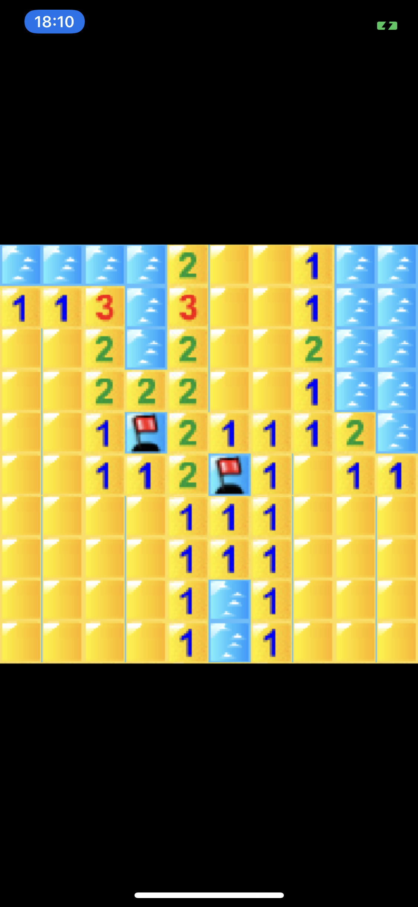

# MinesweeperLove2D

A Basic MineSweeper for Love2D
Can be launch on desktop and mobile. 
On mobile a long press place flag

## Setup
- `npm install`
- Have LOVE installed in path

## Running
- `npm run start`

## Packing for sending 
- `npm run pack`

## Mobile

The build is the same. you just need the love2d app to read `.love` file